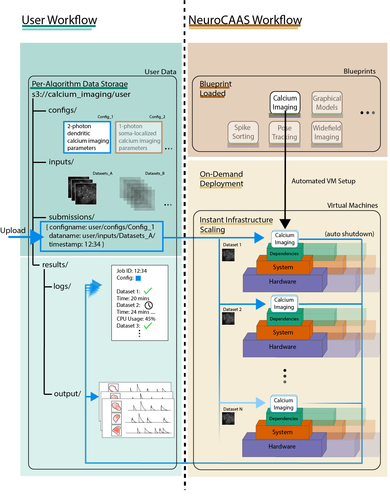

The Big Picture
===============

In this guide, we will describe a process to *incrementally automate*
all of the steps you would need to take to set up and use your analysis. 
This starts by setting up a script that can fetch data from a remote location, and write results back to that remote location when complete, forming the core of a job, 
as we went through in the Quickstart section. 
However, it would be a massive pain if the usage model for your analysis was that users upload their data to remote storage, then send you a message so you can 
analyze it on your machine. You could imagine that this would cause long wait times, and maybe your hardware wouldn't be able to handle really big datasets. 

Instead, analyses on NeuroCAAS specify instructions for automated software installation and build (which you may recognize from 
Docker-like services) on a developer-specified cloud hardware instance. 
Analysis jobs are triggered automatically, referencing certain datasets and configuration files.  
All of the details needed to make this happen will be specified by you, the developer in the course of this guide, meaning no more dealing with installation and environment issues from your users. 
At the core of the process is a *blueprint* that records the steps you would like to 
automate, as you determine them in the course of the development process. 

End Product
-----------

So what exactly does the end product here look like? 
The goal is to offer data analysis to users in such a way that they can analyze
their data without ever having to purchase, configure, or host analyses on their
own machines. This goal follows the "software as a service" model that has become popular in industry.

In this figure, you can see the resources and workflow that you will be able to 
support with your analysis at the end of the development process: 

Key Points:

- Your analysis will be hosted on cloud based virtual machines (VMs), currently AWS `EC2 instances <https://aws.amazon.com/ec2/>`_. These machines are automatically set up with your analysis software pre-loaded on them, and run automatically when given a dataset to analyze. The main point of this guide is to figure out the set of steps that will make this happen for your particular analysis, and record them in a document called a *blueprint*. 

- A single virtual machine is  *entirely dedicated* to running your analysis on a given dataset. Once it is done analyzing a dataset, it will terminate itself. This means there are no history effects between successive analysis runs: each analysis is governed only by the automatic setup procedure described in your blueprint.  

- For users, data analysis can be done entirely by interacting with data storage in AWS `S3 buckets <https://aws.amazon.com/s3/>`_ (more on setting this up later). Data storage is already structured for them, according to individual analyses and user groups.   

.. code-block::

    s3://{analysis_name}   ## This is the name of the S3 bucket
    |- {group_name}        ## Each NeuroCAAS user is a member of a group (i.e. lab, research group, etc.) 
       |- configs
       |- inputs
       |- submissions
       |  |- {id}_submit.json 
       |- results
          |- job_{timestamp}
             |- logs
             |- process_results

You may recognize that this structure is very similar to the structure of the `s3` directory in the Quickstart demo.              
When users want to trigger a particular analysis run, they upload a file indicating the data and parameters they want to analyze to a special directory called `submissions` (see the figure for content of this file). This upload triggers the automatic VM setup process described above, and users simply wait for the results to appear in a separate, designated subdirectory (`results`). Although shown as file storage here, most users will use NeuroCAAS through a web client that automates the process of uploading submission files.
This S3 bucket and the relevant directory structure will be generated once you deploy your analysis scripts (see section: Deploying your blueprint). 
If you want to see how the user interacts with this file structure, sign up for an account on `neurocaas.org <www.neurocaas.org>`_. 

 
   
We’ll describe the process of developing analyses for
NeuroCAAS in four steps: 

1. Initializing a blueprint and linking to NeuroCAAS

2. Choosing hardware and computing environment 

3. Setting up your automatic analysis runs (i.e. extending the quickstart example)

4. Testing and deployment. 

All steps are available via a python and shell
script based API. Development will follow a principle of Infrastructure
as Code (IaC), meaning that all of your development steps will be
documented in code as you build.

