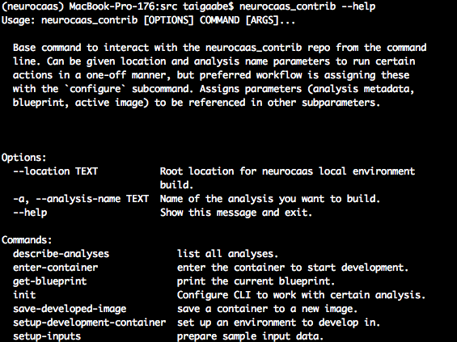

.. NeuroCAAS installation guide. 

Installing NeuroCAAS for Analysis Development
=============================================

Prerequisites
-------------
Before installing NeuroCAAS for development, you will need the following: 

- A Github account
- An installation of `Anaconda <https://docs.anaconda.com/anaconda/install/>`_ or `Miniconda <https://docs.conda.io/projects/continuumio-conda/en/latest/user-guide/install/>`_ to manage your python environment.  
- jq 1.6 (a json parser)- *install via brew/apt-get*
- The AWS CLI: Installation instruction available `here <https://docs.aws.amazon.com/cli/latest/userguide/install-cliv2.html>`_. Don't worry about configuring this, as we'll do that later.  
    

Installing NeuroCAAS Repos
--------------------------

There are two repositories to keep track of when developing for NeuroCAAS. The first is the *source repo*, where all of the code that makes up the NeuroCAAS platform is stored. You are currently reading the docs for this source repo. The second is the *contrib repo*, which provides a CLI tool to help add new analyses to the source repo. You will get a local version of both in this step. 

Let's install the contrib repo. To start off, download this repo from github, and move into it: 

.. code-block:: bash

    % git clone https://github.com/cunningham-lab/neurocaas_contrib
    % cd path/to/your/neurocaas_contrib

Now create and configure a conda environment as follows:  

.. code-block:: bash

    % conda create -n neurocaas python=3.6.9 # create environment
    % conda activate neurocaas # activate environment
    % python -m pip install --upgrade pip # upgrade package manager
    % pip install -r requirements.txt # install dependencies
    % pip install -e ./src # install neurocaas_contrib python package 

Once you've done this, you should have the :code:`neurocaas-contrib` CLI. You can check if installation when smoothly by running the help command, :code:`neurocaas-contrib --help`, which should display help text giving usage and available subcommands: 

Now that you've got the contrib repo set up, let's move on to the source repo. Unlike the contrib repo (and the majority of open source neuroscience code), you will not directly clone the source repo. Instead, you will create a *fork* of the repository, with your own local and remote copies. Go ahead and navigate to the Github page of the source repo, `found here <https://github.com/cunningham-lab/neurocaas>`_, and follow the first three steps listed here: https://jarv.is/notes/how-to-pull-request-fork-github/. Then, you can install the neurocaas repo as well:  

.. code-block:: bash

    % conda activate neurocaas
    % cd path/to/your/neurocaas 

    % pip install -e . # install neurocaas python package 

Now, at the end of this process, you should have both the source and contrib repos on your local machine, with their python packages installed, like so: 

.. code-block:: bash  

   /
   |-path/to/neurocaas
   |-path/to/neurocaas_contrib

Importantly, the source repo, `neurocaas` should be a fork of the original repo, :code:`cunningham-lab/neurocaas`, and you should see your own version of the source repo on Github, :code:`<your username>/neurocaas`. Finally you should have the :code:`neurocaas-contrib` command line tool. 
