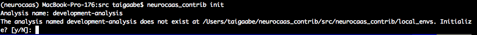
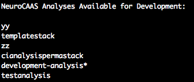

Initializing a blueprint
========================

We first need to initialize a blueprint for your analysis that will record you development process.
This portion of the process should take about 10-15 minutes. 
All NeuroCAAS blueprints are stored in a single directory in the source repo, in 
:code:`neurocaas/ncap_iac/ncap_blueprints`. This is where you will create your new analysis as well.  

We will use the CLI tool to create a new analysis here. 

Navigate to the
`ncap_blueprints` directory, and run the command:

.. code-block:: bash

   neurocaas-contrib init --location /path/to/neurocaas/ncap_iac/ncap_blueprints

This will let your CLI tool know that this location is the place it should store analysis blueprints that you develop. 
Upon running this command, you will be prompted for the name of the analysis you want to develop, and asked to create one if it does not exist already:

Note that the analysis name must be restricted to lowercase letters, numbers, and hyphens (-). 
If you find yourself working on multiple analyses at once, you can switch between them by running this command as well. 
You can always remind yourself what analysis you are configured to work with by calling the command :code:`neurocaas-contrib describe-analyses`:

Doing so will list the analyses you have available in your chosen blueprint storage location, as well as the one that is currently initialized (indicated by an asterisk).

Once you have initialized a blueprint, you can examine it in any text editor at the path: 

.. code-block:: bash

   /path/to/neurocaas/ncap_iac/ncap_blueprints/<analysis_name>/stack_config_template.json

This blueprint contains all of the details that specify the different resources 
and services that will support your analysis. When initializing an analysis, 
we can leave most of these fixed, but there are a few that we should go over: 
The parameters that you will probably change are:

- :code:`PipelineName`: This should be the name of your analysis, or something similar. 

- :code:`REGION`: The global region (An AWS parameter) where you want to develop. By default "us-east-1" is a good choice.   

- :code:`STAGE`: This parameter describes different stages of pipeline development. It should be set to "webdev" while initializing a blueprint.

- :code:`Lambda.LambdaConfig.INSTANCE\_TYPE`: :code:`INSTANCE\_TYPE` specifies the hardware configuration that is run by default (can be changed on demand) and is selected from a list of instance types available on AWS. A good default choice is :code:`m5.xlarge`, and a good choice with access to a GPU is :code:`p2.xlarge`. 

Important parameters to keep in mind for later: 
- :code:`Lambda.LambdaConfig.AMI`: :code:`AMI` specifies the Amazon Machine Image where your software and dependencies are installed, and contains most of the analysis-specific configuration details that you must specify. As you develop, you will save your progress into different AMIs so they can be linked to the blueprint through this parameter. 

- :code:`Lambda.LambdaConfig.COMMAND`: :code:`COMMAND` specifies a shell command that will be run on your remote instance [with parameters specified in the main script section] to generate data analysis. This command can technically take the form of any shell command, but will most likely take the form :code:`cd /home/ubuntu; neurocaas_contrib/run_main_cli.sh {} {} {} {} path_to_analysis_script; . neurocaas_contrib/ncap_utils/workflow.sh; cleanup`. For most use cases, the only thing that you will have to change about the command given here is the :code:`path_to_analysis_script`. More specifics of this command will be specified later.    

- :code:`Affiliates`: This field describes users of the analysis. It is largely used for testing, as when it is deployed later, all users will be able to access this analysis by default. For now, remove all :code:`Affiliates` from the :code:`UXData` area except for “debuggers”; we will return to this later in this section.
 

Linking your blueprint to cloud resources
----------------------------------------- 

We have now reached the point where you will have to start interacting with cloud resources, which means that you will need AWS account credentials. 
This portion of the process should take about 10 minutes, and response time from the NeuroCAAS Team (within 24h), or setup time of an AWS account (about 1-2h). 

Developing within the main NeuroCAAS account (recommended)
~~~~~~~~~~~~~~~~~~~~~~~~~~~~~~~~~~~~~~~~~~~~~~~~~~~~~~~~~~
We recommend you develop your analysis within the main NeuroCAAS account. By doing so, you can use AWS resources to develop the optimal configuration to deploy your analysis for free. 

You can get AWS account credentials by: 

1. Signing up for a user account at `neurocaas.org <https://www.neurocaas.org/>`_  
2. Letting the NeuroCAAS team know that you have an initialized blueprint in place at :code:`neurocaas@gmail.com`. 

Once this process is done, you will be able to access important details that will be used to link your account to cloud resources through your profile on the NeuroCAAS website. You can access your profile by clicking on your name in the top right hand corner of the NeuroCAAS website, or navigating `here <http://www.neurocaas.org/profile/>`_.

At this point, we can revisit the :code:`Affiliates` section of the blueprint. From your NeuroCAAS website profile, take the value of the fields `AWS User Name`, and `S3 Bucket For Datasets and config files`. We will refer to this as your user name and group name. Within your blueprint, replace the :code:`AffiliateName` :code:`debuggers` with your group name, and replace the given :code:`UserNames` with your user name (make sure you don't delete the brackets- user names must be formatted as a list). Linking your AWS credentials to the blueprint in this way will ensure that you can test your analysis after deployment. In the future, you can add other testers to your analysis in the same way. 

We will now prepare your blueprint for cloud-based development using Github pull requests `(in depth explanation here) <https://blog.axosoft.com/learning-git-pull-request/>`_ . 
First, go ahead and push your new blueprint to your version of the neurocaas repo if you haven't already: 

.. code-block:: bash

    git add /path/to/neurocaas/ncap_iac/ncap_blueprints/<analysis_name>/
    git commit -m "initialized blueprint for <analysis_name>" # or something like that
    git push 

Then, you can go ahead and open a pull request on the original neurocaas Github page (see step 7 `here <https://jarv.is/notes/how-to-pull-request-fork-github/>`_).  
Add a comment to your pull request that specifies what your analysis does, and we will be ready to start working with you! 

Note that if you develop more blueprints later, you will still submit pull requests, but you can use the same credentials. 

Configuring Credentials with the main NeuroCAAS account
*******************************************************
**Important: this section deals with security credentials. Please proceed carefully.**

From the previous step, you should now have an AWS Key Pair (Key and Secret Key),
either from a pull request, or from an independent account. 
These credentials will allow your to launch cloud compute instances, 
and as such are extremely valuable. 
**IMPORTANT: You MUST keep this file
in separate, secure directory not under version control. If this key is
exposed, it poses financial risks and privacy risks to the entire account.** 

First verify your aws cli installation by running:

.. code-block:: bash

    % aws configure

When prompted, enter the access key and secret access key associated
with your IAM user account, as well as the AWS region you are closest
to. Set the default output type to be :code:`json`.
IMPORTANT: If using the NeuroCAAS account to develop, please set your
AWS region to be **us-east-1**.  

Once you have the aws cli configured with your credentials, you  
have full developer privileges. You can now additionally retrieve 
an ssh key to let you log in to remote instances and develop on them interactively.

In order to retrieve your ssh key, navigate
within the source repository to:

:code:`/path/to/neurocaas/ncap_iac/ncap_blueprints/utils_stack`. Type the following
command:

.. code-block:: bash

    % bash print_privatekey.sh > securefilelocation/securefilename.pem

Where :code:`securefilelocation/securefilename.pem` is a file NOT under
version control. **IMPORTANT: We strongly recommend you keep this file
in separate, secure directory not under version control. If this key is
exposed, it will expose the development instances of everyone on your
account**. You will reference this key when developing a machine image
later. Finally, change the permissions on this file with:

.. code-block:: bash

    % chmod 400 securefilelocation/securefilename.pem

With these credentials in place, you are now ready to choose the hardware and computing environment for your analysis.     

Cloning NeuroCAAS to an alternative AWS Account
~~~~~~~~~~~~~~~~~~~~~~~~~~~~~~~~~~~~~
**Skip to Developing On the Command Line if you are developing within the main NeuroCAAS account**.

Alternatively, you can also set up development and use of a NeuroCAAS platform clone on a separately managed AWS account. NOTE: AWS charges in real time for resource use. Although we provide the exact same cloud resource management tools to clone NeuroCAAS platforms through IaC, make sure that you know what you are doing with regard to cost monitoring and EC2 instance management before going with this route.
To proceed with your own AWS account, you will need programmatic access (an AWS key pair) with admin permissions on this account. Using this key pair, follow the steps in :code:`Configuring Credentials` below, and :code:`Cloning the platform` afterwards. 

Configuring Credentials with an alternative AWS Account
*******************************************************

**Important: this section deals with security credentials. Please proceed carefully.**

From the previous step, you should now have an AWS Key Pair (Key and Secret Key),
either from a pull request, or from an independent account. 
These credentials will allow your to launch cloud compute instances, 
and as such are extremely valuable. 
**IMPORTANT: You MUST keep this file
in separate, secure directory not under version control. If this key is
exposed, it poses financial risks and privacy risks to the entire account.** 

First verify your aws cli installation by running:

.. code-block:: bash

    % aws configure

When prompted, enter the access key and secret access key associated
with your admin account, as well as the AWS region you are closest
to. Set the default output type to be :code:`json`.

With these credentials in place, you are now ready to clone NeuroCAAS to your account. 

Cloning the platform
~~~~~~~~~~~~~~~~~~~~
To initialize NeuroCAAS on a separate AWS account, first follow the :code:`Installation` instructions for
the binxio secret provider stack. Doing so will let you manage sensitive information like SSH keys through IaC. 
<https://github.com/binxio/cfn-secret-provider>. 

.. warning:: 

    When following instructions here, make sure that you confirm you are in the region you want to do most of your work in. In particular, if using the console, the default region is :code:`eu-central-1`: make sure to change this in the dropdown menu to the region closest to you. 
 
Navigate within the
neurocaas repository to: `neurocaas/ncap_iac/ncap_blueprints/utils_stack`.

Now run the following command:

.. code-block:: bash

    % bash initialize_neurocaas.sh

This will create the cloud resources necessary to deploy your resources
regularly and handle the permissions necessary to manage and deploy
cloud jobs, and ssh keys to access resources on the cloud. The results
of initialization can be seen in the file
`global_params_initialized.json`, with the names of resources listed. If
you encounter an error, consult the contents of the file
`neurocaas/ncap_iac/ncap_blueprints/utils_stack/init_log.txt`, and post
it to the neurocaas issues page.

Once you have done this step, you have a working instance of the NeuroCAAS platform set up in a different infrastructure stack. 

Setting up developer tools for your cloned platform
***************************************************

Now that you have a clone of NeuroCAAS, you can configure it to use the same testing resources that we use locally. 

First, create a test user. Run the following command from the AWS CLI: 

.. code-block::     

    aws iam create-user --user-name test-user{your_region_name} 

Where you substitute in your region name for the bracketed area. You will refer to this test user when creating blueprints.     

Next, we'll set up the forked NeuroCAAS repository with your credentials so that you can deploy blueprints through Github. 
We will add four secrets to your fork of the NeuroCAAS repo as described `here <https://docs.github.com/en/actions/security-guides/encrypted-secrets#creating-encrypted-secrets-for-a-repository>`_.
Take your AWS key pair, and passthe key and secret key respectively under the fields `DEPLOY_AWS_ACCESS_KEY_ID` and `DEPLOY_AWS_SECRET_ACCESS_KEY`. 

Furthermore, you'll want to create a docker token as described `here: <https://docs.docker.com/docker-hub/access-tokens/>`_, and pass additionally your access token as `DOCKER_HUB_ACCESS_TOKEN` and your docker username as `DOCKER_HUB_USERNAME`. These credentials are required because we use Docker to deploy analyses to NeuroCAAS via IaC.  

Finally, in order to retrieve your ssh key, navigate
within the source repository to:

:code:`/path/to/neurocaas/ncap_iac/ncap_blueprints/utils_stack`. Type the following
command:

.. code-block:: bash

    % bash print_privatekey.sh > securefilelocation/securefilename.pem

Where :code:`securefilelocation/securefilename.pem` is a file NOT under
version control. **IMPORTANT: We strongly recommend you keep this file
in separate, secure directory not under version control. If this key is
exposed, it will expose the development instances of everyone on your
account**. You will reference this key when developing a machine image
later. Finally, change the permissions on this file with:

.. code-block:: bash

    % chmod 400 securefilelocation/securefilename.pem

Cloning an existing analysis from the main repo to a cloned repo     
*****************************************************************

You can clone an analysis from the main NeuroCAAS analysis by modifying the blueprint for the analysis as follows: 

1. Change the given :code:`PipelineName` parameter: these are unique across all of AWS. 
2. Delete the security group given, and let it be autofilled by your NeuroCAAS account clone. 
3. Request that the AMI underlying the analysis be shared from the main account via a github issue.    
4. Open a pull request with the changed blueprint into your own repository, and comment on the pull request with the command: :code:`#deploy:{foldername}`, where foldername is replaced by the name of the folder where your blueprint is stored in `ncap_blueprints`.  Doing so will trigger an automatic deployment of this analysis on your account. 

